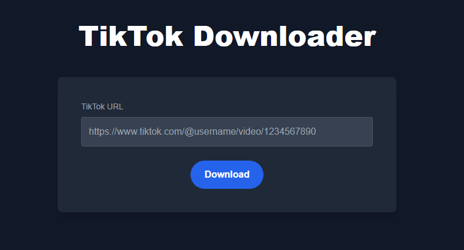

# TikTok Downloader - Download Video TikTok Tanpa Watermark

## 💻Tentang Proyek

**TikTok Downloader** adalah aplikasi web yang memungkinkan Anda untuk mendownload video TikTok tanpa watermark secara gratis. Cukup masukkan URL video TikTok dan unduh video dengan cepat, aman, dan mudah. 

### 🚀Fitur Utama
- **Tanpa Watermark**: Download video TikTok tanpa watermark.
- **Mudah Digunakan**: Masukkan link video, klik unduh, dan selesai!
- **Gratis dan Cepat**: Tidak ada batasan unduhan dan tidak perlu mendaftar.
- **Responsive Design**: Berfungsi di perangkat mobile dan desktop.

## 👀Demo Langsung
Coba langsung aplikasinya: [TikTok Downloader](https://bimadevs.github.io/tiktok-downloader/)

## Cara Menggunakan
1. Buka TikTok dan salin URL video yang ingin diunduh.
2. Tempelkan URL tersebut di kotak input pada halaman.
3. Klik tombol "Download".
4. Video akan diunduh tanpa watermark.

## Teknologi yang Digunakan
- **HTML5**: Struktur halaman.
- **CSS3**: Desain dan styling halaman.
- **JavaScript**: Mengelola fungsionalitas unduhan.
- **API TikTok**: Untuk mendapatkan video tanpa watermark.

## Kontribusi
Kami selalu menerima kontribusi dari komunitas! Jika Anda ingin menambahkan fitur baru atau menemukan bug, silakan buat pull request atau buka issue.

## Lisensi
Proyek ini dilisensikan di bawah [MIT License](LICENSE).

## Kontak
- **Pengembang**: [BimaDevs](https://github.com/bimadevs)
- **Website**: [bimadevs.github.io/tiktok-downloader](https://bimadevs.github.io/tiktok-downloader/)

